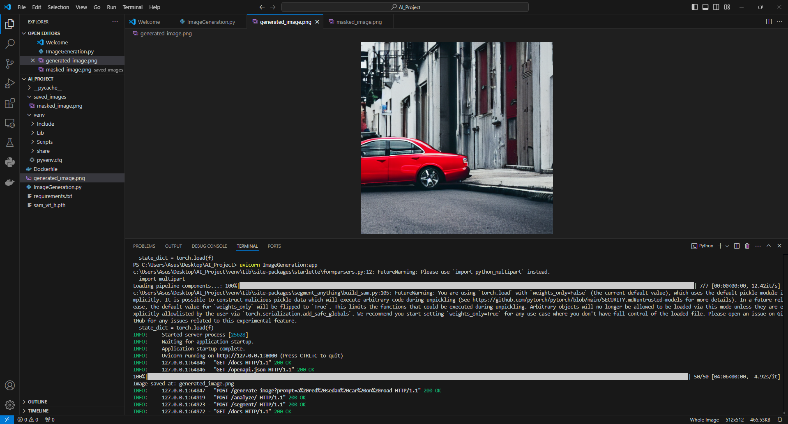
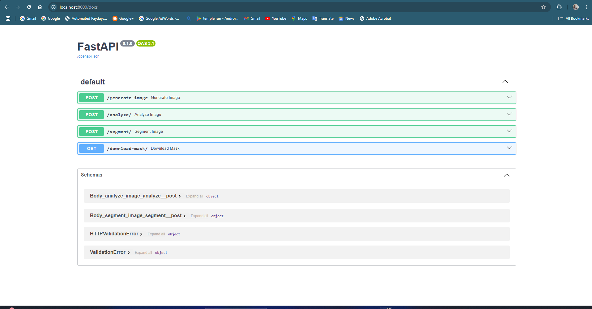
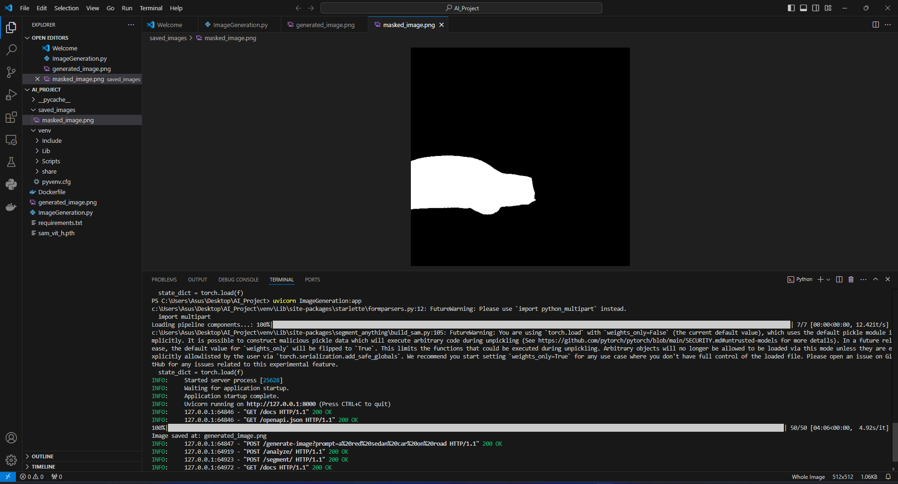

# Text-to-Image Generation with Multi-Model Analysis

This project focuses on building a **Text-to-Image Generation** pipeline using **Stable Diffusion**, **CLIP (Contrastive Language-Image Pretraining)**, and **Segment Anything Model 2 (SAM2)**. The pipeline allows for text-to-image generation, image analysis using CLIP, and image segmentation using SAM2, all accessible via a **FastAPI** web service.

## Project Overview

The pipeline integrates the following:

- **Stable Diffusion**: Generates images based on text prompts.
- **CLIP**: Analyzes images to extract features that can be used for tasks like similarity search.
- **SAM2 (Segment Anything Model)**: Performs image segmentation to detect objects and regions within images.

This repository contains the following key components:

- **FastAPI Web Server**: Serves the API endpoints for image generation, analysis, and segmentation.
- **Stable Diffusion Model**: Generates images from text prompts.
- **CLIP Model**: Analyzes images to extract feature representations.
- **SAM2 Model**: Performs automatic image segmentation.
- **Logging**: For tracking errors, image processing, and model usage.
  
## Project Setup

Setup Instructions
Pre-requisites:
Python 3.8+
PyTorch with CUDA support (for GPU acceleration).
FastAPI, uvicorn, diffusers, segment_anything, clip, and other dependencies listed in requirements.txt.

### Prerequisites

Before you begin, ensure you have the following installed:

- Python 3.8+
- CUDA-enabled GPU (optional, for faster processing)
- Virtual environment (recommended)

### Clone the Repository

```bash
git clone https://github.com/your_username/your_project.git
cd your_project
```

### Setup the Environment

1. Create a virtual environment:

    ```bash
    python -m venv venv
    source venv/bin/activate  # On Windows: venv\Scripts\activate
    ```

2. Install dependencies:

    ```bash
    pip install -r requirements.txt
    ```

### Install Additional Libraries

```bash
pip install torch diffusers clip segment-anything fastapi uvicorn Pillow
```

### Download Models

- **Stable Diffusion**: You will need to download the `stable-diffusion-v1-4` model from the Hugging Face model hub or use an equivalent checkpoint.
  
- **CLIP**: The `ViT-B/32` model is used in this project.
  
- **SAM2**: Download the SAM2 model checkpoint from the [SAM2 repository](https://github.com/facebookresearch/segment-anything).

Once the models are downloaded, place the checkpoints in an accessible directory (e.g., `C:/Users/Asus/Desktop/AI_Project/sam_vit_h.pth`).

## Running the Project

1. **Run the FastAPI Server**:

    ```bash
    uvicorn ImageGeneration:app --reload
    ```

    This will start the FastAPI server at `http://127.0.0.1:8000`.

2. **Generate Image from Text**:

    Endpoint: `/generate-image`

    Example request (POST):

    ```bash
    curl -X 'POST' \
      'http://127.0.0.1:8000/generate-image?prompt=A beautiful sunset over the mountains' \
      -H 'accept: application/json'
    ```

    The server will respond with a link to the generated image.

3. **Analyze Image using CLIP**:

    Endpoint: `/analyze/`

    Example request (POST):

    ```bash
    curl -X 'POST' \
      'http://127.0.0.1:8000/analyze/' \
      -H 'accept: application/json' \
      -H 'Content-Type: multipart/form-data' \
      -F 'file=@path_to_image.jpg'
    ```

    The server will return CLIP feature analysis of the image.

4. **Segment Image using SAM2**:

    Endpoint: `/segment/`

    Example request (POST):

    ```bash
    curl -X 'POST' \
      'http://127.0.0.1:8000/segment/' \
      -H 'accept: application/json' \
      -H 'Content-Type: multipart/form-data' \
      -F 'file=@path_to_image.jpg'
    ```

    The server will return segmentation masks for the uploaded image, along with a downloadable link for the segmented image.

5. **Download Segmented Image**:

    Endpoint: `/download-mask/`

    Example request (GET):

    ```bash
    curl -X 'GET' \
      'http://127.0.0.1:8000/download-mask/' \
      -H 'accept: image/png'
    ```

## Project Code Breakdown

### FastAPI API Endpoints

- **/generate-image**: Generates an image based on a text prompt using Stable Diffusion.
- **/analyze/**: Analyzes an image using CLIP to extract feature representations.
- **/segment/**: Segments an image using SAM2, detecting objects and regions in the image.
- **/download-mask/**: Downloads the most recently segmented image.

### Error Handling and Logging

- **Logging**: The project uses `logging` to track the status of model loading, image processing, and segmentation steps. Check logs for more details when running into issues.
- **Error Handling**: Errors during image processing and segmentation will return meaningful error messages in the API responses.

## Example Logs

Example of a successful image segmentation:

```bash
INFO:     Received image for segmentation
INFO:     Image loaded successfully with shape (512, 512, 3)
INFO:     Starting SAM segmentation...
INFO:     SAM segmentation completed, found 3 masks
INFO:     Masked image saved at C:/Users/Asus/Desktop/AI_Project/saved_images/masked_image.png
```

## Troubleshooting

### Common Errors

1. **Memory Issues**: If the segmentation is taking too much memory, consider reducing the image resolution or using a smaller model checkpoint.
2. **Model Loading**: Ensure that the model checkpoints are placed in the correct directory and the paths are set correctly in the code.
3. **GPU/CPU Switching**: The pipeline automatically detects GPU if available; otherwise, it will fallback to CPU, but ensure you have enough resources.

### TypeError: Object of type 'ndarray' is not JSON serializable

This error occurs when trying to serialize a NumPy array directly in the response. Ensure to convert NumPy arrays to Python lists before returning in the API response.


Here’s a comprehensive **README** section that includes **API Documentation**, **Test Suite Instructions**, and **Setup Instructions** for running the project on both **GPU** and **CPU** environments. This is the suggested content you can add to your README:

---

## Setup Instructions

### Pre-requisites:
1. **Python 3.8+**
2. **PyTorch** with CUDA support (for GPU acceleration).
3. **FastAPI**, **uvicorn**, **diffusers**, **segment_anything**, **clip**, and other dependencies listed in `requirements.txt`.

### Environment Setup for GPU and CPU

#### GPU Setup (NVIDIA CUDA)
To leverage the GPU (CUDA) environment, you need a working GPU with the appropriate drivers and libraries installed. Follow the steps below:

1. **Install CUDA Toolkit**:
   Download and install the [CUDA Toolkit](https://developer.nvidia.com/cuda-downloads) compatible with your GPU.

2. **Install PyTorch with GPU support**:
   Use the following command to install PyTorch with CUDA support:
   ```bash
   pip install torch torchvision torchaudio --index-url https://download.pytorch.org/whl/cu118
   ```

3. **Install Project Dependencies**:
   Install the other dependencies from the `requirements.txt` file:
   ```bash
   pip install -r requirements.txt
   ```

4. **Run the Application**:
   Start the FastAPI server using `uvicorn`:
   ```bash
   uvicorn ImageGeneration:app --host 0.0.0.0 --port 8000 --reload
   ```

#### CPU Setup (Non-GPU)
If you don’t have a GPU available or want to run the project in a CPU environment, follow these steps:

1. **Install PyTorch for CPU**:
   Install the CPU version of PyTorch:
   ```bash
   pip install torch torchvision torchaudio
   ```

2. **Install Project Dependencies**:
   Install the other dependencies as listed in `requirements.txt`:
   ```bash
   pip install -r requirements.txt
   ```

3. **Run the Application**:
   Start the FastAPI server using `uvicorn`:
   ```bash
   uvicorn ImageGeneration:app --host 0.0.0.0 --port 8000 --reload
   ```

---

## API Documentation

The project uses **FastAPI** for exposing APIs. You can access the **API documentation** by visiting `http://127.0.0.1:8000/docs` after running the FastAPI server.

### Available Endpoints:

1. **Generate Image (`POST /generate-image`)**
   - **Description**: Generates an image from a text prompt using Stable Diffusion.
   - **Request Body**:
     ```json
     {
       "prompt": "A red sedan car on road"
     }
     ```
   - **Response**: The generated image file (PNG format).

2. **Analyze Image (`POST /analyze/`)**
   - **Description**: Performs analysis on an uploaded image using CLIP.
   - **Request Body**: The image file (via form data).
   - **Response**:
     ```json
     {
       "clip_analysis": "Encoded image features"
     }
     ```

3. **Segment Image (`POST /segment/`)**
   - **Description**: Performs image segmentation using SAM2 on an uploaded image.
   - **Request Body**: The image file (via form data).
   - **Response**: The segmented mask and segmentation results.
     ```json
     {
       "segmentation": "Segmentation results",
       "masks": "Mask data"
     }
     ```

### Test the API
To test the API, you can either use:
1. The built-in **Swagger UI** available at `http://127.0.0.1:8000/docs`.
2. Use **cURL** or a tool like **Postman** to send requests to the API.

Example `cURL` command for generating an image:
```bash
curl -X 'POST' \
  'http://127.0.0.1:8000/generate-image' \
  -H 'accept: image/png' \
  -H 'Content-Type: application/json' \
  -d '{"prompt": "A red sedan car on road"}'
```

---

## Test Suite

### Unit Tests
Unit tests can be added to validate the functionality of the components (Stable Diffusion, CLIP, SAM2). Testing should be done with both valid inputs and edge cases.

#### How to Run the Tests:
1. Install the required test dependencies:
   ```bash
   pip install pytest
   ```

2. Run the tests:
   ```bash
   pytest tests/
   ```

### Example Test Cases
Here are some possible unit test cases you can write:

- Test if the Stable Diffusion model generates an image from a prompt.
- Test if the CLIP model analyzes the image correctly.
- Test if SAM2 can generate a mask for a given image.

---

## Example Outputs

### 1. Generated Image using Stable Diffusion

This is an example of an image generated from a text prompt like "A red sedan car on road":



### 2. FastAPI Endpoint in Action

Below is a screenshot of the FastAPI interface used for image generation, analysis and segmentation:



### 3. Masked Image from SAM2 Segmentation

This image shows an example of how the SAM2 model segments an uploaded image:



